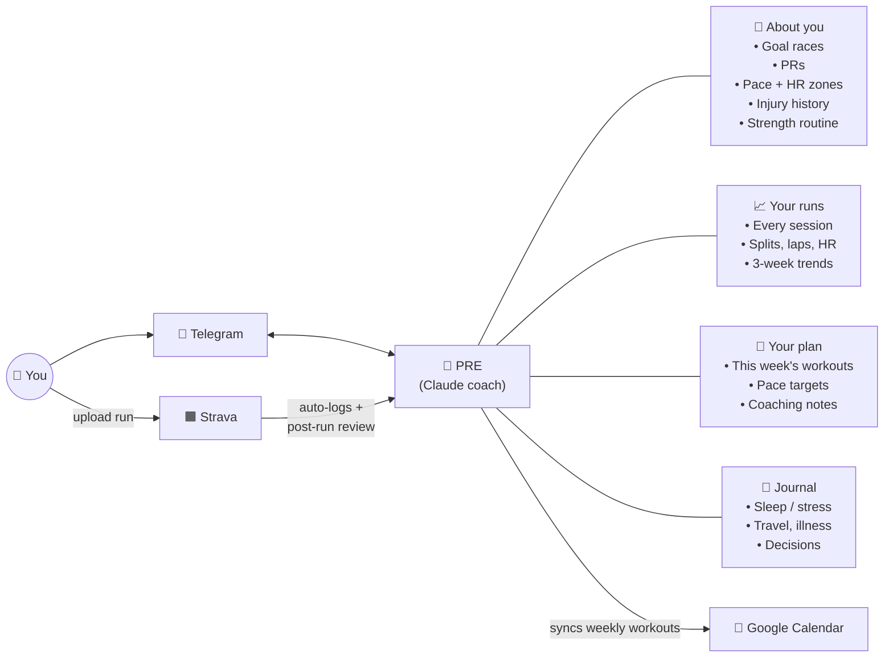

<p align="center">
  
</p>

<h1 align="center">PRE — AI Running Coach Bot</h1>

<p align="center"><em>An elite endurance coach in your pocket. Reads your runs, writes your plan, syncs to your calendar.</em></p>

## What PRE does for you

- **Auto-logs every run from Strava** — pulls splits, laps, HR, elevation the moment an activity uploads.
- **Writes and adapts your training plan** — a Claude-powered coach drafts the week, adjusts when life intervenes.
- **Reviews each workout** — a separate post-activity LLM pass critiques the session and can propose a plan change for you to approve on your next chat.
- **Pushes workouts to your Google Calendar** — your week shows up on your phone alongside everything else, with full coaching notes in the event description.
- **Talks to you over Telegram** — chat naturally, or use slash commands like `/today`, `/race`, `/log`.
- **Remembers your context** — PRs, pace and HR zones, injury history, strength routine, and a journal of sleep / stress / travel.

## What PRE knows about you



Everything PRE remembers lives in local files in `state/`. Strava feeds into PRE read-only; Google Calendar is written one-way out.

## How it works

Every turn the agent loads the full state (athlete profile, training plan, recent sessions, journal) into the system prompt and decides which tools to call:

- `get_today` / `get_todays_workout` / `get_week_plan` — read the prescribed plan
- `log_session` — append a session to `log.jsonl`
- `update_plan` — replace `plan.md` (preserving the locked weekly table format)
- `update_athlete` — patch `athlete.yaml` (PRs, zones, resolved injuries)
- `append_journal` — add a timestamped life-context note
- `get_sessions` — date-range query on `log.jsonl`
- `get_fitness_summary` — soft-touch trailing snapshot: weekly volume, pace-vs-zone decoration on quality sessions, HR context, English signals (no prescriptions)
- `sync_plan_to_calendar` / `get_calendar_status` — push the locked weekly table from `plan.md` to a dedicated "PRE Training" Google Calendar (one-way, bot → gcal). Called once per turn after plan edits are final.

Strava activity uploads run on a separate path: the webhook fetches the activity, deterministically translates it into a `log.jsonl` entry, fires a Telegram ping, and asynchronously runs a post-activity LLM review that may stash a plan-change proposal in Redis for the next chat turn.

Short-term conversation history lives in Redis (~10 turns, 2-hour TTL). Long-term context lives in `state/` files.

## Tech stack

- **LLM**: Claude Sonnet 4.6 (default) via Heroku Inference, OpenAI-compatible client. Prompt-caching attempted via `cache_control` (falls back to plain string if the proxy rejects it).
- **State**: local files — `athlete.yaml` (round-trip via `ruamel.yaml`), `plan.md`, `log.jsonl`, `journal.md`
- **Session store**: Redis (single-user, single key, 2h TTL)
- **Pending proposals**: Redis (`pending_plan_proposal`, 24h TTL) — surfaces in the next system prompt
- **Interfaces**: Telegram webhook (`app.py` + `bot.py`), CLI (`main.py`), test harness (`scripts/test_agent.py`)
- **External integrations**: Strava (webhook + REST), Google Calendar (REST, write-only)
- **Deployment**: Railway via gunicorn (`Procfile`)

## State files

| File | Contents |
|------|----------|
| `athlete.yaml` | identity, target races, PRs, pace + HR zones, preferences, injury history, race history, strength + PT routines |
| `plan.md` | current training block; locked `\| Day \| Date \| Workout \| Pace target \| Notes \|` weekly table (parsed by `/today` and the calendar sync) |
| `log.jsonl` | one session per line: date, type, miles, pace_avg, hr_avg, rpe, notes, details{splits, laps, strava_id, elevation, best efforts} |
| `journal.md` | freeform timestamped notes (sleep, stress, travel, decisions) |
| `plan_changelog.md` | append-only log of plan edits + reasons |

`state/` is gitignored — keep it local or in a separate private repo. Full schema reference: [docs/state-schema.md](docs/state-schema.md).

## Prerequisites

- Python 3.9+
- Redis (local or hosted)
- Heroku Inference API key (with access to `claude-sonnet-4-6` or `claude-opus-4-7`)
- Telegram Bot token (for the Telegram interface)
- *Optional:* Strava API app for auto-logging
- *Optional:* Google Cloud OAuth credentials for calendar sync

## Installation

```bash
git clone https://github.com/elimchayseng/pre-running-coach-bot.git
cd pre-running-coach-bot
python -m venv venv
source venv/bin/activate
pip install -r requirements.txt
cp .env.example .env       # fill in your keys
```

Then create your `state/athlete.yaml` and `state/plan.md`. See the example shapes in [docs/state-schema.md](docs/state-schema.md) and the schema descriptions in `tools/state.py`.

## Environment variables

**Required**

| Var | Purpose |
|-----|---------|
| `HEROKU_INFERENCE_URL` | LLM endpoint (OpenAI-compatible), e.g. `https://us.inference.heroku.com/v1` |
| `HEROKU_INFERENCE_KEY` | LLM API key |
| `REDIS_URL` | Redis connection string |
| `TELEGRAM_BOT_TOKEN` | Bot token from @BotFather |

**Optional / behavior**

| Var | Purpose |
|-----|---------|
| `HEROKU_MODEL` | Override the default model (`claude-sonnet-4-6`) |
| `WEBHOOK_URL` | Deployed app URL — used to register the Telegram webhook on startup |
| `TELEGRAM_WEBHOOK_SECRET` | Optional shared secret for verifying Telegram requests |
| `USER_TIMEZONE` | IANA tz (e.g. `America/Los_Angeles`); falls back to server local time |
| `RACE_DATE` | Override the next race date (ISO `YYYY-MM-DD`) for testing |

**Strava (optional)**

| Var | Purpose |
|-----|---------|
| `STRAVA_CLIENT_ID` / `STRAVA_CLIENT_SECRET` | OAuth credentials from <https://www.strava.com/settings/api> |
| `STRAVA_VERIFY_TOKEN` | Shared secret used to verify the webhook subscription |
| `USER_TELEGRAM_CHAT_ID` | Where to send activity pings |
| `STRAVA_TOKENS_BACKEND` | `file` (default, local) or `redis` (Railway — filesystem is ephemeral) |

**Google Calendar (optional)**

| Var | Purpose |
|-----|---------|
| `GCAL_CLIENT_ID` / `GCAL_CLIENT_SECRET` | OAuth credentials (Desktop app type) |
| `CALENDAR_ID` | ID of your dedicated "PRE Training" calendar |
| `GCAL_TOKENS_BACKEND` | `file` (default) or `redis` |

## Usage

### Test harness (recommended for iteration)

```bash
./venv/bin/python scripts/test_agent.py
```

REPL with no Telegram or Redis dependency. Slash commands: `/quit /reset /state /tools /system /raw`.

### CLI

```bash
./venv/bin/python main.py
```

### Telegram (webhook)

```bash
./venv/bin/python app.py        # local
gunicorn app:app                 # production
```

### Slash commands (CLI + Telegram)

| Command | Description |
|---------|-------------|
| `/today` | Today's prescribed workout (no LLM round-trip) |
| `/plan` | Print the current training plan |
| `/log [days]` | Recent sessions, default last 7 days |
| `/race` | Race countdown and training phase |
| `/reset` | Clear short-term Redis history (state files unchanged) |
| `/health` | Check Redis + LLM connectivity |
| `/help` | Show commands |
| `/quit` (CLI only) | Exit |

Free-text messages route through the agent and may invoke any of the tools above.

## Strava integration

Strava drives the **auto-log** flow: when an activity uploads, Strava POSTs to `/strava/webhook`, the app fetches the full activity (splits, laps, best efforts, HR), deterministically classifies it (easy / workout / race / cross-train / strength), appends it to `log.jsonl`, and pings Telegram. Then a **post-activity LLM review** runs asynchronously — it critiques the session against the prescribed plan and may stash a plan-change proposal in Redis (`pending_plan_proposal`, 24h TTL) that surfaces in your next chat for explicit approval.

Resilience:
- Webhooks retry on `404` with exponential backoff (Strava sometimes serves the activity before its detail endpoint is ready)
- Idempotent — duplicate webhook deliveries no-op via `details.strava_id`
- `aspect_type=update` replaces the existing log entry (handles retags / edits)
- Token storage: `file` (`.strava_tokens.json`) for local, `redis` for Railway

One-time setup:

1. Create an API app at <https://www.strava.com/settings/api>. Set the callback domain to your deployed host.
2. Copy `client_id` / `client_secret` into `.env`.
3. Generate a `STRAVA_VERIFY_TOKEN` and put it in `.env`.
4. Run OAuth + register the webhook subscription:

```bash
./venv/bin/python scripts/strava_setup.py auth         # OAuth, requests activity:read_all
./venv/bin/python scripts/strava_setup.py status       # verify env + tokens
./venv/bin/python scripts/strava_setup.py subscribe    # register webhook
./venv/bin/python scripts/strava_setup.py list-subs    # confirm
```

Backfill historical activities (idempotent, supports time windows + dry-run):

```bash
./venv/bin/python scripts/strava_backfill.py --since 30d
./venv/bin/python scripts/strava_backfill.py --since 2026-04-01 --dry-run
```

## Google Calendar integration

Push the weekly table from `plan.md` into a dedicated "PRE Training" Google Calendar so workouts show up on your phone alongside everything else (with gcal's native fan-out to Apple Calendar / smartwatches). For quality sessions and races, the per-day `#### YYYY-MM-DD` detail block from `plan.md` gets synced verbatim into the event description — so on race morning you can pull up the event and see your pacing plan, checkpoints, and execution cues without opening a separate app.

Architecture: one-way write only (bot → gcal). The agent calls `sync_plan_to_calendar` once at the end of any turn that edited the plan. A local sync-state file (`state/.gcal_sync_state.json`) tracks per-event hashes so reruns are no-ops when nothing has changed. Stale `pre_managed` events in a ±60d window get pruned automatically.

One-time GCP setup (manual):
1. Google Cloud Console → enable the Google Calendar API
2. OAuth consent screen → External, add yourself as a Test User
3. Create OAuth client → application type **Desktop app**
4. Copy `client_id` / `client_secret` into `.env` as `GCAL_CLIENT_ID` / `GCAL_CLIENT_SECRET`
5. In the Google Calendar UI: create a new "PRE Training" calendar → Settings → "Integrate calendar" → copy the Calendar ID into `.env` as `CALENDAR_ID`

Then:

```bash
./venv/bin/python scripts/google_calendar_setup.py auth      # OAuth (loopback listener)
./venv/bin/python scripts/google_calendar_setup.py status    # verify env + tokens + calendar
./venv/bin/python scripts/google_calendar_setup.py sync --dry-run
./venv/bin/python scripts/google_calendar_setup.py sync
```

While the OAuth consent screen is in "testing" mode, refresh tokens for unverified apps expire after 7 days. When that happens, just rerun `scripts/google_calendar_setup.py auth`. Pursuing production verification is overkill for a single-user app.

To back out the integration entirely:

```bash
./venv/bin/python scripts/google_calendar_setup.py purge --yes
```

## Coach personality

> PRE is an elite endurance coach: clinical, demanding, uncompromising. Brutal truth over comfort. Thinks macrocycle → mesocycle → microcycle → today. Obsessive about biometrics (HRV, HR, RPE, sleep) — uses them to catch trouble early. Shuts down training when fatigue, pain, or form warrant it.

The full system prompt — voice rules, format constraints, tool-use norms — lives in `config.py:PRE_PERSONALITY` and `companion.py:build_system_prompt`.

## Deployment

Deploy to Railway with the included `Procfile`:

1. Create a new project on [Railway](https://railway.app)
2. Connect your GitHub repo
3. Add environment variables from `.env.example`
4. Railway will auto-detect the `Procfile` and deploy

State files are not included in the deploy by default (gitignored). Either:
- Keep state in a private companion repo and clone on deploy, or
- Use a Railway volume mounted at `state/`.

For Strava / Google Calendar on Railway, set `STRAVA_TOKENS_BACKEND=redis` and `GCAL_TOKENS_BACKEND=redis` — the filesystem is ephemeral.

## Tests

```bash
./venv/bin/python -m pytest -q
```

## Project structure

```
├── app.py                        Flask webhook (Telegram + Strava)
├── bot.py                        Telegram handlers
├── main.py                       CLI chat
├── companion.py                  Agent loop: build_system_prompt, agent_turn, chat
├── state_manager.py              State file I/O (read/write/atomic/round-trip YAML)
├── temporal_context.py           Timezone-aware now/today + race resolution
├── conversation_store.py         Redis short-term history
├── pending_proposal_store.py     Redis stash for post-activity plan proposals
├── config.py                     LLM client, env validation, PRE_PERSONALITY
├── health.py                     Health checks + slash command list
├── tools/                        Tool schemas + handlers
│   ├── state.py                  log_session, update_plan, append_journal,
│   │                             update_athlete, get_sessions
│   ├── plan.py                   get_today, get_todays_workout, get_week_plan
│   ├── fitness.py                get_fitness_summary (soft-touch signals)
│   └── calendar.py               sync_plan_to_calendar, get_calendar_status
├── strava/                       OAuth, REST client, webhook handler,
│                                 translator (activity → log entry),
│                                 post-activity LLM review, Telegram notify
├── google_calendar/              OAuth, REST client, plan → events sync
├── scripts/
│   ├── test_agent.py             CLI harness, no Redis required
│   ├── strava_setup.py           OAuth + webhook subscription mgmt
│   ├── strava_backfill.py        Import historical activities
│   └── google_calendar_setup.py  OAuth + sync/purge ops
├── docs/                         Schema reference, audit notes
└── tests/                        pytest
```
