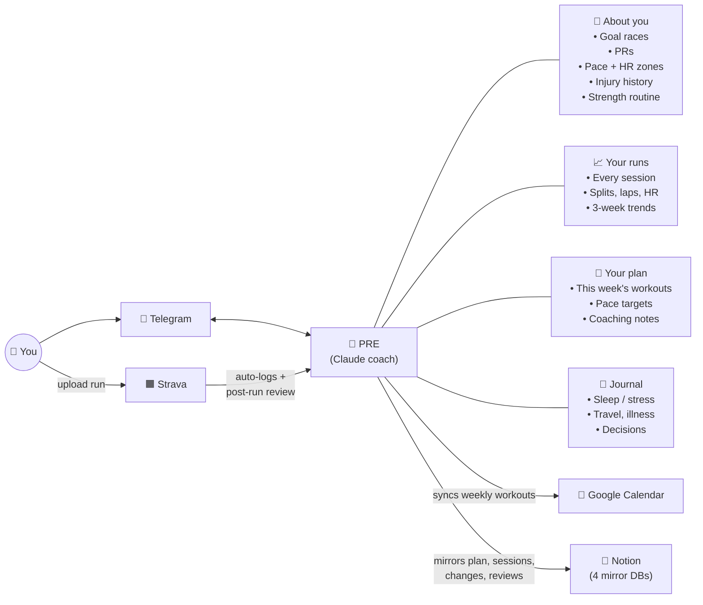

<p align="center">
  
</p>

<h1 align="center">PRE — AI Running Coach Bot</h1>

<p align="center"><em>An elite endurance coach in your pocket. Reads your runs, writes your plan, syncs to your calendar.</em></p>

## What PRE does for you

-  **Auto-logs every run from Strava** — pulls splits, laps, HR, elevation the moment an activity uploads.
- **Writes and adapts your training plan** — a Claude-powered coach drafts the week, adjusts when life intervenes.
- **Reviews each workout** — a separate post-activity LLM pass critiques the session and can propose a plan change for you to approve on your next chat. Reviews are persisted, not ephemeral.
-  **Pushes workouts to your Google Calendar** — your week shows up on your phone alongside everything else, with full coaching notes in the event description.
-  **Mirrors your training data into Notion** — sessions, journal entries, every plan change with before/after diffs, and every post-activity review land in four Notion databases under a single parent page. One-way, best-effort, fully optional.
- **Talks to you over Telegram** — chat naturally, or use slash commands like `/today`, `/race`, `/log`.
- **Remembers your context** — PRs, pace and HR zones, injury history, strength routine, and a journal of sleep / stress / travel.

## What PRE knows about you



Everything PRE remembers lives in a single SQLite DB (`state/coach.db`, mounted on a Railway volume in prod). Strava feeds into PRE read-only; Google Calendar and Notion are written one-way out.

## How it works

Every turn the agent loads the full state (athlete profile, plan prose + this week's prescribed table, recent sessions, journal) into the system prompt and decides which tools to call:

- `get_today` / `get_todays_workout` / `get_week_plan` / `get_week_status` — read the prescribed plan and weekly completion state
- `log_session` — log a session; under the hood it reconciles against the plan (flips a matching planned row to `completed` or inserts an off-plan row)
- `update_workout(date, …)` — **preferred** single-day prescription edit (patches one row)
- `replace_week_table(rows, …)` — bulk replace for block / phase transitions
- `update_plan(markdown, …)` — escape hatch for full-plan rewrites (parses the markdown into planned rows + plan prose)
- `update_athlete` — patch the athlete YAML (PRs, zones, resolved injuries)
- `append_journal` — add a timestamped life-context note
- `get_sessions` — date-range query
- `get_fitness_summary` — soft-touch trailing snapshot: weekly volume, pace-vs-zone decoration on quality sessions, HR context, English signals (no prescriptions)
- `sync_plan_to_calendar` / `get_calendar_status` — push the prescription rows to a dedicated "PRE Training" Google Calendar (one-way, bot → gcal). Called once per turn after plan edits are final.

Strava activity uploads run on a separate path: the webhook fetches the activity, deterministically translates it into a session row (reconciling it against the plan), fires a Telegram ping, and asynchronously runs a post-activity LLM review. The review is persisted to the `reviews` table and mirrored into Notion; any proposed plan change is also stashed in Redis for the next chat turn so the user can approve it.

Short-term conversation history lives in Redis (~10 turns, 2-hour TTL). Long-term state lives in SQLite. The Notion mirror (when configured) reflects new writes into four Notion databases within a few seconds via daemon threads — see [Notion mirror](#notion-mirror) below.

## Tech stack

- **LLM**: Claude Sonnet 4.6 (default) via Heroku Inference, OpenAI-compatible client. Prompt-caching attempted via `cache_control` (falls back to plain string if the proxy rejects it).
- **State**: single SQLite DB (`state/coach.db`) at schema v5. `athlete` round-trips via `ruamel.yaml`; plan lives as rows in `sessions` + prose in `plan_meta`.
- **Session store**: Redis (single-user, single key, 2h TTL)
- **Pending proposals**: Redis (`pending_plan_proposal`, 24h TTL) — surfaces in the next system prompt
- **Interfaces**: Telegram webhook (`app.py` + `bot.py`), CLI (`main.py`), test harness (`scripts/test_agent.py`)
- **External integrations**: Strava (webhook + REST), Google Calendar (REST, write-only), Notion (REST, write-only mirror to four databases — optional)
- **Deployment**: Railway via gunicorn (`Procfile`). DB schema migrations run from `gunicorn.conf.py:on_starting` before workers serve traffic.

## State

All bot/agent state lives in a single SQLite database (`state/coach.db` locally, mounted on a Railway persistent volume in prod). Current schema: **v5**.

| Table | Contents |
|-------|----------|
| `sessions` | **Unified plan-as-rows.** One row per workout in a lifecycle state — `planned` / `completed` / `missed` / `off-plan`. `prescribed_workout` / `prescribed_pace` / `prescribed_notes` / `detail_md` carry what the plan asked for; `data` JSON carries the actuals once logged. Partial UNIQUE index on `details.strava_id` enforces webhook idempotency. |
| `plan_meta` | Plan prose that doesn't belong in the weekly checklist — phases, goals, pace zones, adjustment triggers. |
| `plan_changelog` | Append-only changelog of every plan write (note + timestamp). |
| `athlete` | YAML text in `yaml_text` — identity, target races, PRs, pace + HR zones, preferences, injury history. Round-trip via ruamel. |
| `journal` | Freeform timestamped entries. |
| `reviews` | One row per post-activity LLM review — critique, optional `proposed_change` JSON, `status` (NULL = Pending). FK to `sessions(id)`. |
| `gcal_sync_state` | Per-event sync metadata for the Google Calendar integration. |

Schema source of truth: [`state/schema.sql`](state/schema.sql). Full reference: [docs/state-schema.md](docs/state-schema.md). The Phase 1A cutover (v3 → v4) runs once on deploy from `gunicorn.conf.py:on_starting` via `scripts/cutover_to_unified_sessions.py`; later migrations (e.g. v4 → v5) are purely additive `CREATE TABLE IF NOT EXISTS` and land the next time `_ensure_schema` runs.

### Inspecting state

```bash
# Local
sqlite3 state/coach.db 'SELECT date, status, type, prescribed_workout FROM sessions ORDER BY date DESC LIMIT 20'
sqlite3 state/coach.db 'SELECT id, date, status FROM reviews ORDER BY id DESC LIMIT 10'
python scripts/state_dump.py log --since 2026-05-01     # completed-session actuals
python scripts/state_dump.py plan_meta                  # plan prose
python scripts/state_dump.py --all

# Prod (Railway): one-shot query
railway ssh "sqlite3 /app/data/coach.db 'SELECT date, type FROM sessions ORDER BY date DESC LIMIT 20'"

# Prod: pull the full DB down for offline inspection / TablePlus / diffing
./scripts/state_pull.sh -o /tmp/prod-coach.db
sqlite3 /tmp/prod-coach.db
```

### Backups

A daily Railway scheduled job runs `scripts/backup_db.py`, which uses SQLite's online-backup API to snapshot the DB and pushes it to a `state-snapshot` branch on GitHub. See the "Deploy" section for the env vars and cron setup.

## Prerequisites

- Python 3.9+
- Redis (local or hosted)
- Heroku Inference API key (with access to `claude-sonnet-4-6` or `claude-opus-4-7`)
- Telegram Bot token (for the Telegram interface)
- *Optional:* Strava API app for auto-logging
- *Optional:* Google Cloud OAuth credentials for calendar sync

## Installation

```bash
git clone https://github.com/elimchayseng/pre-running-coach-bot.git
cd pre-running-coach-bot
python -m venv venv
source venv/bin/activate
pip install -r requirements.txt
cp .env.example .env       # fill in your keys
```

Then seed your local DB from the example state files committed in `state/`:

```bash
python scripts/migrate_state_to_sqlite.py state --db state/coach.db --reset
```

Singleton blobs (plan, athlete, journal) are upserted on every run so re-running picks up edits to `state/plan.md` / `state/athlete.yaml`. The `--reset` flag wipes the `sessions` table — use it for the first seed only. Without `--reset`, sessions dedupe by strava_id (UNIQUE index) and identical-row content (so weekly_summary entries don't double). See the example shapes in [docs/state-schema.md](docs/state-schema.md) and the schema in `state/schema.sql`.

## Environment variables

**Required**

| Var | Purpose |
|-----|---------|
| `HEROKU_INFERENCE_URL` | LLM endpoint (OpenAI-compatible), e.g. `https://us.inference.heroku.com/v1` |
| `HEROKU_INFERENCE_KEY` | LLM API key |
| `REDIS_URL` | Redis connection string |
| `TELEGRAM_BOT_TOKEN` | Bot token from @BotFather |

**Optional / behavior**

| Var | Purpose |
|-----|---------|
| `DATABASE_PATH` | SQLite file path (default `state/coach.db`). On Railway set to `/app/data/coach.db` with a volume mounted at `/app/data`. |
| `HEROKU_MODEL` | Override the default model (`claude-sonnet-4-6`) |
| `WEBHOOK_URL` | Deployed app URL — used to register the Telegram webhook on startup |
| `TELEGRAM_WEBHOOK_SECRET` | Optional shared secret for verifying Telegram requests |
| `USER_TIMEZONE` | IANA tz (e.g. `America/Los_Angeles`); falls back to server local time |
| `RACE_DATE` | Override the next race date (ISO `YYYY-MM-DD`) for testing |

**Strava (optional)**

| Var | Purpose |
|-----|---------|
| `STRAVA_CLIENT_ID` / `STRAVA_CLIENT_SECRET` | OAuth credentials from <https://www.strava.com/settings/api> |
| `STRAVA_VERIFY_TOKEN` | Shared secret used to verify the webhook subscription |
| `USER_TELEGRAM_CHAT_ID` | Where to send activity pings |
| `STRAVA_TOKENS_BACKEND` | `file` (default, local) or `redis` (Railway — filesystem is ephemeral) |

**Google Calendar (optional)**

| Var | Purpose |
|-----|---------|
| `GCAL_CLIENT_ID` / `GCAL_CLIENT_SECRET` | OAuth credentials (Desktop app type) |
| `CALENDAR_ID` | ID of your dedicated "PRE Training" calendar |
| `GCAL_TOKENS_BACKEND` | `file` (default) or `redis` |

**Notion mirror (optional)**

| Var | Purpose |
|-----|---------|
| `NOTION_TOKEN` | Integration token from <https://app.notion.com/developers> (Read/Insert/Update content capabilities). Unset → mirror short-circuits silently. |
| `NOTION_PARENT_PAGE_ID` | Page id (32-char hex) of the parent page that holds the four mirror databases. Connect your integration to it. |
| `NOTION_API_VERSION` | Pinned to `2026-03-11` by default. |
| `NOTION_SESSIONS_DS_ID` / `NOTION_JOURNAL_DS_ID` / `NOTION_PLAN_CHANGES_DS_ID` / `NOTION_REVIEWS_DS_ID` | Data-source ids printed by `scripts/notion_bootstrap.py`. Each gates its DB independently — a partially-configured workspace mirrors just what's wired. |

## Usage

### Test harness (recommended for iteration)

```bash
./venv/bin/python scripts/test_agent.py
```

REPL with no Telegram or Redis dependency. Slash commands: `/quit /reset /state /tools /system /raw`.

### CLI

```bash
./venv/bin/python main.py
```

### Telegram (webhook)

```bash
./venv/bin/python app.py        # local
gunicorn app:app                 # production
```

### Slash commands (CLI + Telegram)

| Command | Description |
|---------|-------------|
| `/today` | Today's prescribed workout (no LLM round-trip) |
| `/plan` | Print the current training plan |
| `/log [days]` | Recent sessions, default last 7 days |
| `/race` | Race countdown and training phase |
| `/reset` | Clear short-term Redis history (state files unchanged) |
| `/health` | Check Redis + LLM connectivity |
| `/help` | Show commands |
| `/quit` (CLI only) | Exit |

Free-text messages route through the agent and may invoke any of the tools above.

## Strava integration

Strava drives the **auto-log** flow: when an activity uploads, Strava POSTs to `/strava/webhook`, the app fetches the full activity (splits, laps, best efforts, HR), deterministically classifies it (easy / workout / race / cross-train / strength), appends it to `log.jsonl`, and pings Telegram. Then a **post-activity LLM review** runs asynchronously — it critiques the session against the prescribed plan and may stash a plan-change proposal in Redis (`pending_plan_proposal`, 24h TTL) that surfaces in your next chat for explicit approval.

Resilience:
- Webhooks retry on `404` with exponential backoff (Strava sometimes serves the activity before its detail endpoint is ready)
- Idempotent — duplicate webhook deliveries no-op via `details.strava_id`
- `aspect_type=update` replaces the existing log entry (handles retags / edits)
- Token storage: `file` (`.strava_tokens.json`) for local, `redis` for Railway

One-time setup:

1. Create an API app at <https://www.strava.com/settings/api>. Set the callback domain to your deployed host.
2. Copy `client_id` / `client_secret` into `.env`.
3. Generate a `STRAVA_VERIFY_TOKEN` and put it in `.env`.
4. Run OAuth + register the webhook subscription:

```bash
./venv/bin/python scripts/strava_setup.py auth         # OAuth, requests activity:read_all
./venv/bin/python scripts/strava_setup.py status       # verify env + tokens
./venv/bin/python scripts/strava_setup.py subscribe    # register webhook
./venv/bin/python scripts/strava_setup.py list-subs    # confirm
```

Backfill historical activities (idempotent, supports time windows + dry-run):

```bash
./venv/bin/python scripts/strava_backfill.py --since 30d
./venv/bin/python scripts/strava_backfill.py --since 2026-04-01 --dry-run
```

## Google Calendar integration

Push the weekly table from `plan.md` into a dedicated "PRE Training" Google Calendar so workouts show up on your phone alongside everything else (with gcal's native fan-out to Apple Calendar / smartwatches). For quality sessions and races, the per-day `#### YYYY-MM-DD` detail block from `plan.md` gets synced verbatim into the event description — so on race morning you can pull up the event and see your pacing plan, checkpoints, and execution cues without opening a separate app.

Architecture: one-way write only (bot → gcal). The agent calls `sync_plan_to_calendar` once at the end of any turn that edited the plan. The `gcal_sync_state` table tracks per-event hashes so reruns are no-ops when nothing has changed. Stale `pre_managed` events in a ±60d window get pruned automatically. Each sync also runs `reconcile_completion` against the last 14 days of logs so any session that should have been marked complete (but wasn't, e.g. webhook fired before a feature shipped) self-heals.

One-time GCP setup (manual):
1. Google Cloud Console → enable the Google Calendar API
2. OAuth consent screen → External, add yourself as a Test User
3. Create OAuth client → application type **Desktop app**
4. Copy `client_id` / `client_secret` into `.env` as `GCAL_CLIENT_ID` / `GCAL_CLIENT_SECRET`
5. In the Google Calendar UI: create a new "PRE Training" calendar → Settings → "Integrate calendar" → copy the Calendar ID into `.env` as `CALENDAR_ID`

Then:

```bash
./venv/bin/python scripts/google_calendar_setup.py auth      # OAuth (loopback listener)
./venv/bin/python scripts/google_calendar_setup.py status    # verify env + tokens + calendar
./venv/bin/python scripts/google_calendar_setup.py sync --dry-run
./venv/bin/python scripts/google_calendar_setup.py sync
```

While the OAuth consent screen is in "testing" mode, refresh tokens for unverified apps expire after 7 days. When that happens, just rerun `scripts/google_calendar_setup.py auth`. Pursuing production verification is overkill for a single-user app.

To back out the integration entirely:

```bash
./venv/bin/python scripts/google_calendar_setup.py purge --yes
```

## Notion mirror

PRE mirrors its state into four Notion databases so you can see your training in the same workspace you already use for everything else. SQLite stays the **source of truth**; the mirror is one-way, best-effort, and fully optional — without `NOTION_TOKEN`, the bot behaves exactly as before.

**The four databases (all under a single parent page):**

| DB | Source | Page body |
|---|---|---|
| **PRE Sessions** | every `sessions` row, `sid:{id}` | coaching detail + notes / laps / splits |
| **PRE Journal** | every journal entry, `jid:{title}` | the entry text |
| **PRE Plan Changes** | every changelog entry, `cid:{timestamp}` | `## Before` / `## After` fenced markdown of the affected row(s) — flips to `## Prescribed` / `## Actuals` when the change is a Strava completion |
| **PRE Reviews** | every post-activity review, `rid:{id}` | `## Critique` + `## Proposed change` (summary as quote, proposed new plan fenced as markdown, italic reason). `Session` property relates back to the matching Sessions page. |

**How it works.** Every SQLite write (session reconcile, plan edit, journal append, post-activity review) ends with a daemon-thread fire-and-forget call into `notion/mirror.py`. The mirror queries the target Notion database by a hidden `source_key` property — hit → patch, miss → insert — so re-running the seed or remirroring the same row never duplicates. A module-level lock serializes the query-then-insert path so two threads can't race into a duplicate page. Failures (auth, rate-limit, network) log a warning and are dropped; nothing on the user-facing path waits for Notion.

**One-time setup:**

1. Create an internal integration at <https://app.notion.com/developers>. Enable **Read content**, **Insert content**, **Update content**. Copy the secret into `.env` as `NOTION_TOKEN`.
2. Create a Notion page to be the parent (e.g. `PRE Training`). On that page: `••• → Connections → connect` your integration. Copy the 32-char page id from the URL into `.env` as `NOTION_PARENT_PAGE_ID`.
3. Bootstrap the four databases (idempotent — safe to re-run):

```bash
./venv/bin/python scripts/notion_bootstrap.py
```

   Paste the printed `NOTION_*_DB_ID` / `NOTION_*_DS_ID` lines into `.env`.

4. Backfill from SQLite (idempotent via `source_key`):

```bash
./venv/bin/python scripts/notion_seed.py
```

From that point on, every live write reflects into Notion within ~5 seconds. `/health` includes a Notion probe (`users.me`) when `NOTION_TOKEN` is set.

**Verifying the mirror is working.** Edit a plan day via Telegram (`"swap Tuesday to easy 5"`), then look in the **PRE Plan Changes** database — a new row should appear within a few seconds with the diff in the page body. Or query directly:

```bash
sqlite3 state/coach.db "SELECT content FROM plan_changelog WHERE id=1" | tail -3
# ...then look up the matching `cid:<timestamp>` page in Notion
```

**Reversing it.** The mirror is one-way. Editing or trashing a Notion page changes nothing in SQLite. `scripts/notion_seed.py` reconstructs the Notion side from SQLite at any time.

## Coach personality

> PRE is an elite endurance coach: clinical, demanding, uncompromising. Brutal truth over comfort. Thinks macrocycle → mesocycle → microcycle → today. Obsessive about biometrics (HRV, HR, RPE, sleep) — uses them to catch trouble early. Shuts down training when fatigue, pain, or form warrant it.

The full system prompt — voice rules, format constraints, tool-use norms — lives in `config.py:PRE_PERSONALITY` and `companion.py:build_system_prompt`.

## Deployment

Deploy to Railway with the included `Procfile`:

1. Create a new project on [Railway](https://railway.app)
2. Connect your GitHub repo
3. Add environment variables from `.env.example`
4. **Mount a persistent volume at `/app/data`** (Settings → Volumes → New Volume). 1 GB is plenty. This is where `coach.db` lives — without it, every deploy wipes your logs, plan edits, and athlete profile.
5. Set `DATABASE_PATH=/app/data/coach.db` in the Railway env.
6. Set `STRAVA_TOKENS_BACKEND=redis` and `GCAL_TOKENS_BACKEND=redis` (the filesystem outside the volume is ephemeral).
7. After the first deploy with the volume attached, seed the DB once:

```bash
railway shell --service web
python scripts/migrate_state_to_sqlite.py /app/state --db /app/data/coach.db --reset
```

   The bundled `/app/state/*` files in the image are read once to seed the DB, then ignored. The volume's `/app/data/coach.db` is the runtime source of truth from that point on.

8. (Recommended) Wire up the daily backup as a Railway scheduled job:
   - **Schedule**: `0 11 * * *` (UTC; adjust to a low-traffic hour)
   - **Start command**: `python scripts/backup_db.py`
   - **Env vars**: `DATABASE_PATH`, `GITHUB_BACKUP_TOKEN` (PAT with repo write), `GITHUB_REPO` (e.g. `you/pre-running-coach-bot`). Optional: `BACKUP_BRANCH` (default `state-snapshot`), `BACKUP_FORMAT` (default `binary`).

**Important — single worker only.** SQLite-on-volume tolerates many threads but only one writer process. `Procfile` ships with `gunicorn app:app` (default 1 worker); leave it alone. If you ever need multiple processes, migrate to Postgres rather than bumping workers.

## Tests

```bash
./venv/bin/python -m pytest -q
```

## Project structure

```
├── app.py                              Flask webhook (Telegram + Strava)
├── bot.py                              Telegram handlers
├── main.py                             CLI chat
├── companion.py                        Agent loop: build_system_prompt, agent_turn, chat
├── state_manager.py                    SQLite state I/O; mirror hooks fire after commit
├── plan_markdown.py                    Plan-blob parsers + week-table renderer
├── temporal_context.py                 Timezone-aware now/today + race resolution
├── conversation_store.py               Redis short-term history
├── pending_proposal_store.py           Redis stash for post-activity plan proposals
├── config.py                           LLM client, env validation, PRE_PERSONALITY
├── health.py                           Health checks + slash command list
├── gunicorn.conf.py                    on_starting hook: runs the cutover before workers serve
├── tools/                              Tool schemas + handlers
│   ├── state.py                        log_session, update_workout, replace_week_table,
│   │                                   update_plan, append_journal, update_athlete, get_sessions
│   ├── plan.py                         get_today, get_todays_workout, get_week_plan, get_week_status
│   ├── fitness.py                      get_fitness_summary (soft-touch signals)
│   └── calendar.py                     sync_plan_to_calendar, get_calendar_status
├── notion/                             Notion mirror (Phase 1B)
│   ├── client.py                       Thin requests wrapper pinned to Notion-Version 2026-03-11
│   ├── schema.py                       Four DB property schemas + source_key helpers
│   ├── markdown.py                     render_session_body / render_change_body / render_review_body
│   ├── entries.py                      Parsers for journal + plan_changelog singletons
│   └── mirror.py                       Upserts + fire-and-forget daemon threads
├── strava/                             OAuth, REST client, webhook handler,
│                                       translator (activity → session row),
│                                       post-activity LLM review (persists to `reviews`)
├── google_calendar/                    OAuth, REST client, plan rows → events sync
├── scripts/
│   ├── test_agent.py                   CLI harness, no Redis required
│   ├── strava_setup.py                 OAuth + webhook subscription mgmt
│   ├── strava_backfill.py              Import historical activities
│   ├── google_calendar_setup.py        OAuth + sync/purge ops
│   ├── cutover_to_unified_sessions.py  Phase 1A.2 schema cutover (idempotent)
│   ├── notion_bootstrap.py             Find-or-create the four mirror DBs
│   └── notion_seed.py                  Backfill SQLite → Notion (idempotent)
├── docs/                               Schema reference, audit notes
└── tests/                              pytest (~440)
```

## What's next

Phase 1 (the SQLite cutover + the four-database one-way Notion mirror) is complete. Three contained follow-ups are filed as issues for next-day work: [#26](https://github.com/elimchayseng/pre-running-coach-bot/issues/26) (auto-sync plan edits to Google Calendar), [#33](https://github.com/elimchayseng/pre-running-coach-bot/issues/33) (auto-resolve reviews when a proposal is applied), and [#34](https://github.com/elimchayseng/pre-running-coach-bot/issues/34) (custom Notion views — calendar, board, smart filters).

The longer-arc direction for the Notion integration:

- **Phase 2 — bidirectional sync.** Lift `notion/mirror.py` into a Notion Worker (the 3.5 platform's hosted runtime), subscribe to Webhook Triggers so a row edit in Notion writes back into SQLite. Optionally swap our planned-sessions push for Notion's Database Sync pulling from `/notion/sessions`. The mirror becomes a real two-way bridge instead of a read-only reflection.
- **Phase 3 — race-day briefing pages.** LLM-authored markdown via the Markdown API; GPX / route maps as page attachments via the File Upload API. The runner opens the race's Notion page on race morning and has the full pacing plan, course preview, and execution cues in one place.
- **Phase 4 — coaching log + External Agents.** Register PRE via Notion's External Agents API so the runner can `@PRE` from any Notion page to ask about training. State-changing turns get logged into a fifth database so the coaching record is reviewable like any other source of truth.
- **Beyond:** multi-athlete / workspace-scoped OAuth, semantic plan-change diffs (not just before/after row snippets), week-over-week training-load comparisons rendered into Notion as charts.

The architectural choice that makes all of this cheap: SQLite is the source of truth, and every external system (GCal, Notion) is a derived view written one-way. Adding a new sink is a new module under `notion/` (or `gcal/`) with its own `_with_retry`, `enabled()`, and daemon-thread fire-and-forget — no changes to `state_manager.py` beyond a new hook line.
